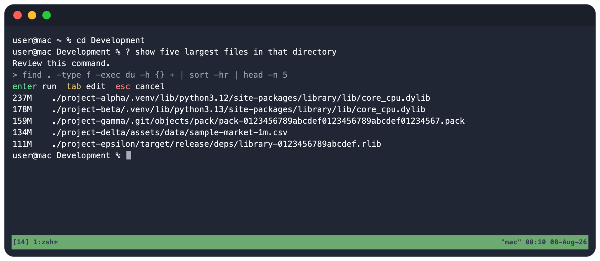

# ask — the Zsh shell and tmux assistant

Turn natural language into shell commands.

<p align="center">
    
</p>

Type `?` followed by your request. `ask` understands your terminal context and turns your intent into shell commands you can review before running.

`ask` uses the OpenAI-compatible Responses API and sends relevant scrollback from the current tmux pane as context. Commands are always proposals: choose `run`, `edit`, or `cancel`. Explanations are returned as plain text.

## Install

Set an API key dedicated to `ask`:

```sh
export ASK_API_KEY="..."
```

By default, `ask` calls OpenAI. Optionally select another OpenAI-compatible endpoint or model:

```sh
export ASK_MODEL="gpt-5.6-luna"
export ASK_REASONING_EFFORT="low"
export ASK_MAX_OUTPUT_TOKENS="512"

# For an OpenAI-compatible endpoint such as vLLM:
export ASK_BASE_URL="https://model.example.com/v1"
export ASK_MODEL="my-model"
```

Install the CLI and Oh My Zsh plugin:

```sh
uv tool install git+https://github.com/mizydorczyk/ask.git
git clone https://github.com/mizydorczyk/ask.git "${ZSH_CUSTOM:-$HOME/.oh-my-zsh/custom}/plugins/ask"
```

Add the plugin in `~/.zshrc` before Oh My Zsh is sourced:

```zsh
plugins=(git ask)
```

Make sure `command -v ask` succeeds before Oh My Zsh loads, then start a new
shell inside tmux. Other plugin managers can source `ask.plugin.zsh` directly.

For example, start or attach to a session with:

```sh
tmux new -As ask
```

ask uses tmux's pane API to read the current pane's scrollback.

## Self-host Models on Hugging Face

To privately host `google/gemma-4-E4B-it` on Hugging Face and connect it to `ask`, work through [the notebook](gemma-4-e4b-it-ask/deploy-model-on-hugging-face.ipynb). It starts and verifies a private vLLM Inference Endpoint, then pauses it after each test session.

To fine-tune the model, follow [the Colab notebook](gemma-4-e4b-it-ask/fine-tune-a-language-model.md). It prepares the dataset and trains the LoRA adapter in [fine-tune-on-colab.ipynb](gemma-4-e4b-it-ask/fine-tune-on-colab.ipynb).
