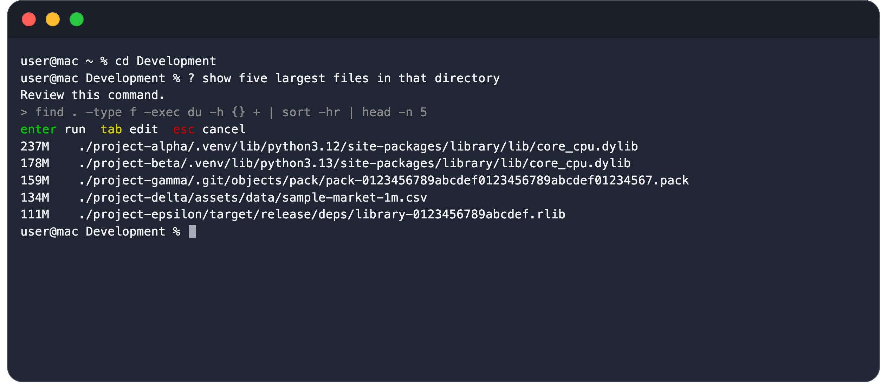

# ask — the Zsh shell and tmux assistant

Turn natural language into shell commands.

<p align="center">
    
</p>

Type `?` followed by your request. `ask` understands your terminal context and turns your intent into shell commands you can review before running.

`ask` uses OpenAI's Responses API and sends relevant scrollback from the current tmux pane as context. Commands are always proposals: choose `run`, `edit`, or `cancel`. Explanations are returned as plain text.

## Install

Set your API key:

```sh
export OPENAI_API_KEY="..."
```

Optionally override the model settings:

```sh
export ASK_MODEL="gpt-5.6-luna"
export ASK_REASONING_EFFORT="low"
export ASK_VERBOSITY="low"
export ASK_MAX_OUTPUT_TOKENS="512"
```

Install the CLI and Oh My Zsh plugin:

```sh
uv tool install git+https://github.com/mizydorczyk/ask.git
git clone https://github.com/mizydorczyk/ask.git "${ZSH_CUSTOM:-$HOME/.oh-my-zsh/custom}/plugins/ask"
```

Add the plugin in `~/.zshrc` before Oh My Zsh is sourced:

```zsh
plugins=(git ask)
```

Make sure `command -v ask` succeeds before Oh My Zsh loads, then start a new
shell inside tmux. Other plugin managers can source `ask.plugin.zsh` directly.

For example, start or attach to a session with:

```sh
tmux new -As ask
```

ask uses tmux's pane API to read the current pane's scrollback.
